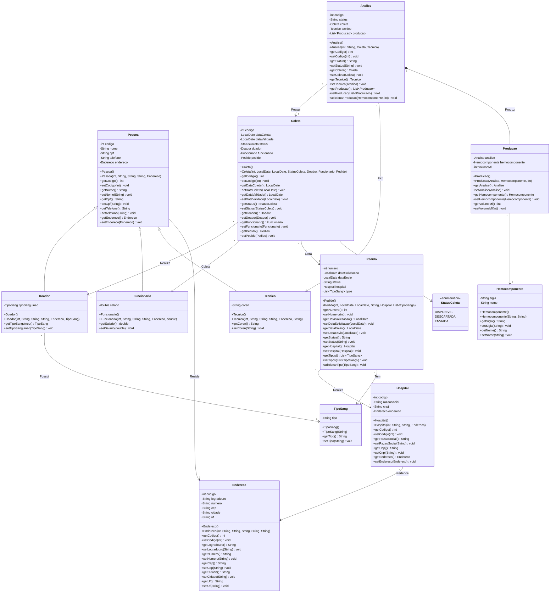

# Diagrama de Classes — Hemocentro

```mermaid
classDiagram
    direction TB

    class Endereco {
        -int codigo
        -String logradouro
        -String numero
        -String cep
        -String cidade
        -String uf
        +Endereco()
        +Endereco(int, String, String, String, String, String)
        +getCodigo() int
        +setCodigo(int) void
        +getLogradouro() String
        +setLogradouro(String) void
        +getNumero() String
        +setNumero(String) void
        +getCep() String
        +setCep(String) void
        +getCidade() String
        +setCidade(String) void
        +getUf() String
        +setUf(String) void
    }

    class Pessoa {
        -int codigo
        -String nome
        -String cpf
        -String telefone
        -Endereco endereco
        +Pessoa()
        +Pessoa(int, String, String, String, Endereco)
        +getCodigo() int
        +setCodigo(int) void
        +getNome() String
        +setNome(String) void
        +getCpf() String
        +setCpf(String) void
        +getTelefone() String
        +setTelefone(String) void
        +getEndereco() Endereco
        +setEndereco(Endereco) void
    }

    class Doador {
        -TipoSang tipoSanguineo
        +Doador()
        +Doador(int, String, String, String, Endereco, TipoSang)
        +getTipoSanguineo() TipoSang
        +setTipoSanguineo(TipoSang) void
    }

    class Funcionario {
        -double salario
        +Funcionario()
        +Funcionario(int, String, String, String, Endereco, double)
        +getSalario() double
        +setSalario(double) void
    }

    class Tecnico {
        -String coren
        +Tecnico()
        +Tecnico(int, String, String, String, Endereco, String)
        +getCoren() String
        +setCoren(String) void
    }

    class TipoSang {
        -String tipo
        +TipoSang()
        +TipoSang(String)
        +getTipo() String
        +setTipo(String) void
    }

    class Hemocomponente {
        -String sigla
        -String nome
        +Hemocomponente()
        +Hemocomponente(String, String)
        +getSigla() String
        +setSigla(String) void
        +getNome() String
        +setNome(String) void
    }

    class StatusColeta {
        <<enumeration>>
        DISPONIVEL
        DESCARTADA
        ENVIADA
    }

    class Hospital {
        -int codigo
        -String razaoSocial
        -String cnpj
        -Endereco endereco
        +Hospital()
        +Hospital(int, String, String, Endereco)
        +getCodigo() int
        +setCodigo(int) void
        +getRazaoSocial() String
        +setRazaoSocial(String) void
        +getCnpj() String
        +setCnpj(String) void
        +getEndereco() Endereco
        +setEndereco(Endereco) void
    }

    class Pedido {
        -int numero
        -LocalDate dataSolicitacao
        -LocalDate dataEnvio
        -String status
        -Hospital hospital
        -List~TipoSang~ tipos
        +Pedido()
        +Pedido(int, LocalDate, LocalDate, String, Hospital, List~TipoSang~)
        +getNumero() int
        +setNumero(int) void
        +getDataSolicitacao() LocalDate
        +setDataSolicitacao(LocalDate) void
        +getDataEnvio() LocalDate
        +setDataEnvio(LocalDate) void
        +getStatus() String
        +setStatus(String) void
        +getHospital() Hospital
        +setHospital(Hospital) void
        +getTipos() List~TipoSang~
        +setTipos(List~TipoSang~) void
        +adicionarTipo(TipoSang) void
    }

    class Coleta {
        -int codigo
        -LocalDate dataColeta
        -LocalDate dataValidade
        -StatusColeta status
        -Doador doador
        -Funcionario funcionario
        -Pedido pedido
        +Coleta()
        +Coleta(int, LocalDate, LocalDate, StatusColeta, Doador, Funcionario, Pedido)
        +getCodigo() int
        +setCodigo(int) void
        +getDataColeta() LocalDate
        +setDataColeta(LocalDate) void
        +getDataValidade() LocalDate
        +setDataValidade(LocalDate) void
        +getStatus() StatusColeta
        +setStatus(StatusColeta) void
        +getDoador() Doador
        +setDoador(Doador) void
        +getFuncionario() Funcionario
        +setFuncionario(Funcionario) void
        +getPedido() Pedido
        +setPedido(Pedido) void
    }

    class Analise {
        -int codigo
        -String status
        -Coleta coleta
        -Tecnico tecnico
        -List~Producao~ producao
        +Analise()
        +Analise(int, String, Coleta, Tecnico)
        +getCodigo() int
        +setCodigo(int) void
        +getStatus() String
        +setStatus(String) void
        +getColeta() Coleta
        +setColeta(Coleta) void
        +getTecnico() Tecnico
        +setTecnico(Tecnico) void
        +getProducao() List~Producao~
        +setProducao(List~Producao~) void
        +adicionarProducao(Hemocomponente, int) void
    }

    class Producao {
        -Analise analise
        -Hemocomponente hemocomponente
        -int volumeMl
        +Producao()
        +Producao(Analise, Hemocomponente, int)
        +getAnalise() Analise
        +setAnalise(Analise) void
        +getHemocomponente() Hemocomponente
        +setHemocomponente(Hemocomponente) void
        +getVolumeMl() int
        +setVolumeMl(int) void
    }

    %% Heranca (Generalizacao Pessoa)
    Pessoa <|-- Doador
    Pessoa <|-- Funcionario
    Pessoa <|-- Tecnico

    %% Relacionamentos
    Pessoa "*" --> "1" Endereco : Reside
    Hospital "*" --> "1" Endereco : Pertence
    Doador "*" --> "1" TipoSang : Possui
    Coleta "*" --> "1" Doador : Realiza
    Coleta "*" --> "1" Funcionario : Coleta
    Coleta "*" --> "0..1" Pedido : Gera
    Coleta --> StatusColeta
    Analise "1" --> "1" Coleta : Possui
    Analise "*" --> "1" Tecnico : Faz
    Analise "1" *-- "*" Producao : Produz
    Producao "*" --> "1" Hemocomponente
    Pedido "*" --> "1" Hospital : Realiza
    Pedido "*" --> "1..*" TipoSang : Tem
```

